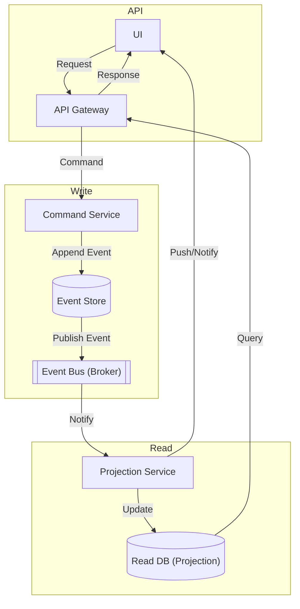

## CQRS + Event Sourcing

> Command Query Responsibility Segregation with Event Sourcing and Real-Time Notifications

### Key Features
 * Strict separation of write (commands/events) and read (queries/projections).
 * Event store is the source of truth.
 * Event bus decouples event propagation.
 * Projection service updates read models and can push updates (e.g., via WebSockets) to UI.
 * Idempotency and replay are built-in.

|- Pros -|- Cons -|
| Full audit/history, replayability, scalable reads, real-time updates | Complex, requires careful design, eventual consistency, debugging can be harder |