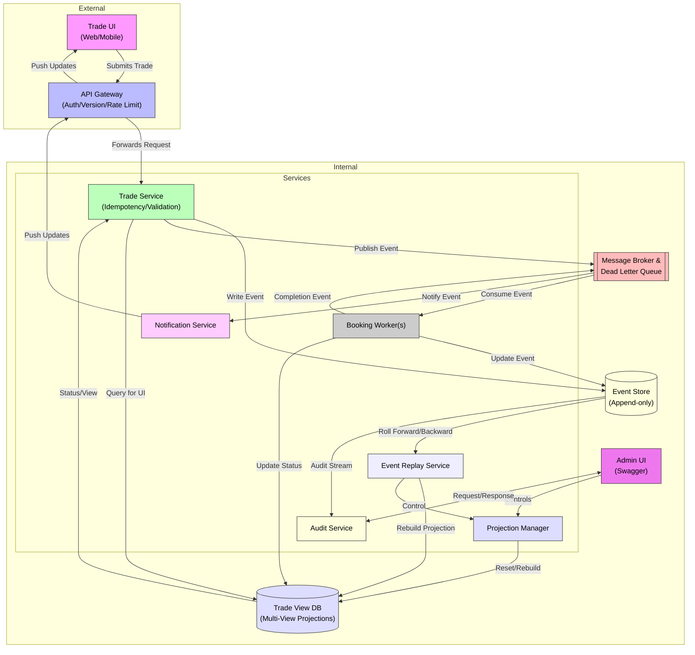

## Trade Processing Architecture

> With Event Sourcing and Real-Time Notifications

```mermaid
flowchart TD
    subgraph External
        ClientUI["Trade UI<br>(Web/Mobile)"]
        APIGW["API Gateway<br>(Auth/Version/Rate Limit)"]
    end

    subgraph Internal
        subgraph Services
            Audit["Audit Service"]
            TradeSvc["Trade Service<br>(Idempotency/Validation)"]
            Booking["Booking Worker(s)"]
            Replay["Event Replay Service"]
            Notify["Notification Service"]
            ProjectionMgr["Projection Manager"]
        end

        AdminUI["Admin UI<br>(Swagger)"]
        Broker[["Message Broker &<br>Dead Letter Queue"]]
        EventStore[("Event Store<br>(Append-only)")]
        DB[("Trade View DB<br>(Multi-View Projections)")]
    end

    ClientUI -- Submits Trade --> APIGW
    AdminUI -- Controls --> ProjectionMgr
    AdminUI <-- Request/Response --> Audit
    APIGW -- Forwards Request --> TradeSvc
    TradeSvc -- Write Event --> EventStore
    TradeSvc -- Publish Event --> Broker
    Broker -- Consume Event --> Booking
    Booking -- Update Event --> EventStore
    Booking -- Update Status --> DB
    DB -- Status/View --> TradeSvc
    TradeSvc -- Query for UI --> DB

    Broker -- Notify Event --> Notify
    Notify -- Push Updates --> APIGW
    APIGW -- Push Updates --> ClientUI

    EventStore -- Roll Forward/Backward --> Replay
    Replay -- Rebuild Projection --> DB
    Replay -- Control --> ProjectionMgr
    EventStore -- Audit Stream --> Audit

    Booking -- Completion Event --> Broker

    ProjectionMgr -- Reset/Rebuild --> DB

    style ClientUI fill:#f9f,stroke:#333,stroke-width:1px,color:#000
    style AdminUI fill:#e7e,stroke:#333,stroke-width:1px,color:#000
    style APIGW fill:#bbf,stroke:#333,stroke-width:1px,color:#000
    style TradeSvc fill:#bfb,stroke:#333,stroke-width:1px,color:#000
    style EventStore fill:#ffd,stroke:#333,stroke-width:1px,color:#000
    style DB fill:#ddf,stroke:#333,stroke-width:1px,color:#000
    style Broker fill:#fbb,stroke:#333,stroke-width:1px,color:#000
    style Booking fill:#ccc,stroke:#333,stroke-width:1px,color:#000
    style Notify fill:#fcf,stroke:#333,stroke-width:1px,color:#000
    style Replay fill:#eef,stroke:#333,stroke-width:1px,color:#000
    style Audit fill:#ffd,stroke:#333,stroke-width:1px,color:#000
    style ProjectionMgr fill:#ddf,stroke:#333,stroke-width:1px,color:#000
```
