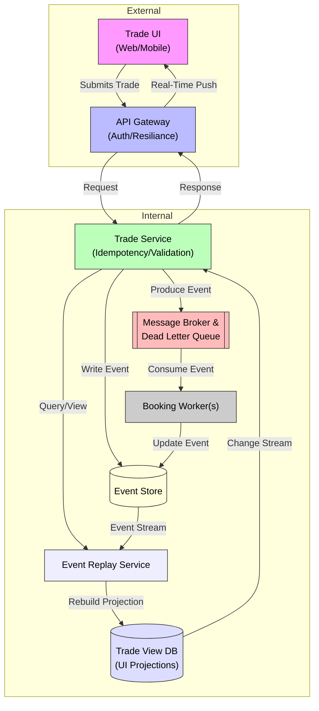

## Trade Processing Architecture

> Command Query Responsibility Segregation with Event Sourcing and Real-Time Notifications

```mermaid
flowchart TD
    subgraph External
        ClientUI["Trade UI<br>(Web/Mobile)"]
        APIGW["API Gateway<br>(Auth/Resiliance)"]
    end

    subgraph Internal
        TradeSvc["Trade Service<br>(Idempotency/Validation)"]
        Queue[["Message Broker &<br>Dead Letter Queue"]]
        Worker["Booking Worker(s)"]
        Projection["Event Replay Service"]
        EventStore[("Event Store")]
        UIDB[("Trade View DB<br>(UI Projections)")]
    end

    ClientUI -- Submits Trade --> APIGW
    APIGW -- Request --> TradeSvc

    TradeSvc -- Write Event --> EventStore
    TradeSvc -- Produce Event --> Queue
    TradeSvc -- Query/View --> Projection

    Queue -- Consume Event --> Worker
    Worker -- Update Event --> EventStore
    EventStore -- Event Stream --> Projection
    Projection -- Rebuild Projection --> UIDB
    UIDB -- Change Stream --> TradeSvc
    TradeSvc -- Response --> APIGW
    APIGW -- Real-Time Push --> ClientUI

    style ClientUI fill:#f9f,stroke:#333,stroke-width:1px,color:#000
    style APIGW fill:#bbf,stroke:#333,stroke-width:1px,color:#000
    style TradeSvc fill:#bfb,stroke:#333,stroke-width:1px,color:#000
    style EventStore fill:#ffd,stroke:#333,stroke-width:1px,color:#000
    style UIDB fill:#ddf,stroke:#333,stroke-width:1px,color:#000
    style Queue fill:#fbb,stroke:#333,stroke-width:1px,color:#000
    style Worker fill:#ccc,stroke:#333,stroke-width:1px,color:#000
    style Projection fill:#eef,stroke:#333,stroke-width:1px,color:#000
```
