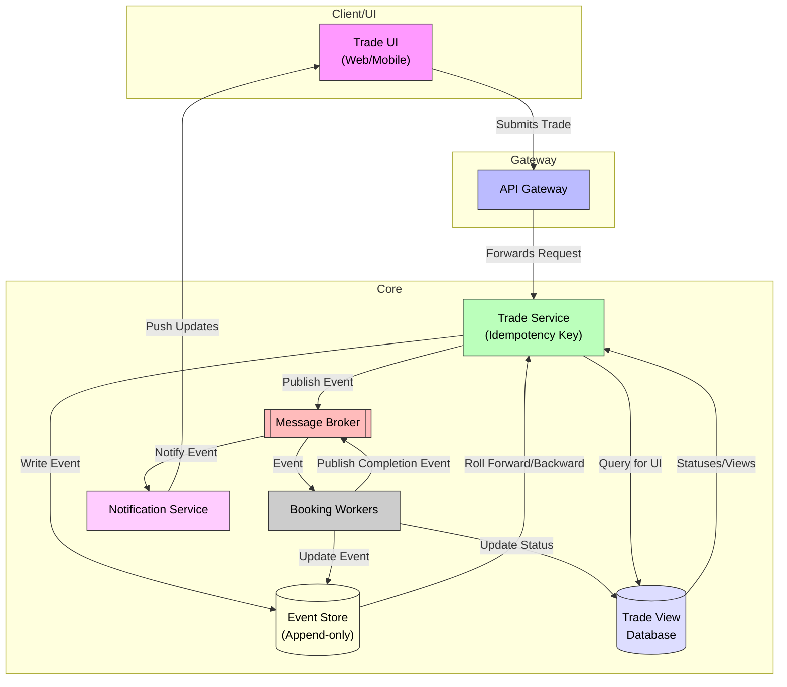

## Trade Processing Architecture with Event Sourcing and Real-Time Notifications

> This diagram illustrates a robust trade processing system architecture designed for reliability, consistency, and real-time updates. The architecture leverages event sourcing, asynchronous messaging, and idempotent API handling to ensure reliable, consistent trade processing with real-time client feedback and Command Query Responsibility Segregation.  

### Client/UI Layer
The user interacts with the system via a Trade UI, accessible through web or mobile devices.  

### Gateway
An API Gateway handles incoming trade requests from the UI, ensuring idempotency by using idempotency keys to prevent duplicate processing.  

### Core Services

The **Trade Service** receives trade requests from the Gateway and writes corresponding events to an append-only Event Store.  

The **Message Broker** publishes these trade events to downstream components.  

The **Booking Engine** subscribes to events from the broker, processes trades by updating their booking status, and records these updates back into the Event Store and a query-optimized trade Database (DB) containing trade views and statuses.  

The **Trade Service** queries this DB to retrieve current trade statuses for UI requests.  

The **Notification Service** listens to events from the broker and pushes real-time updates back to the Trade UI, keeping the client informed of trade status changes.  

The **Event Store** supports rollforward and rollback capabilities, enabling the Trade Service to reconstruct or adjust trade states by replaying events.  

**Real-time** completion events flow from the Booking Engine through the Message Broker to update the Notification Service and UI promptly.  
