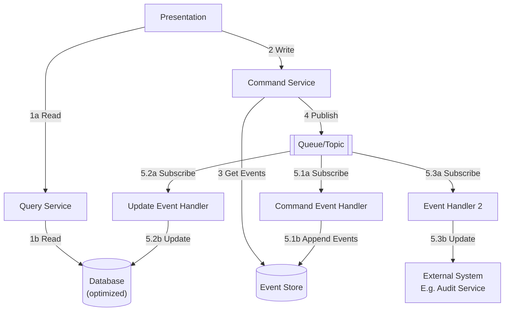

## Event Sourcing Pattern with CQRS

> Event-based messaging with Command Query Responsibility Segregation.

```mermaid
flowchart TD
    UI["Presentation"]
    Command["Command Service"]
    Query["Query Service"]
    Audit["External System<br>E.g. Audit Service"]
    Worker1["Command Event Handler"]
    Worker2["Update Event Handler"]
    Worker3["Event Handler 2"]
    DB[("Database<br>(optimized)")]
    EventStore[("Event Store")]
    Queue[["Queue/Topic"]]

    UI -- 1a Read --> Query
    Query -- 1b Read --> DB
    UI -- 2 Write --> Command
    Command -- 3 Get Events --> EventStore
    Command -- 4 Publish --> Queue
    Queue -- 5.1a Subscribe --> Worker1
    Queue -- 5.2a Subscribe --> Worker2
    Queue -- 5.3a Subscribe --> Worker3
    Worker1 -- 5.1b Append Events --> EventStore
    Worker2 -- 5.2b Update --> DB
    Worker3 -- 5.3b Update --> Audit
```
