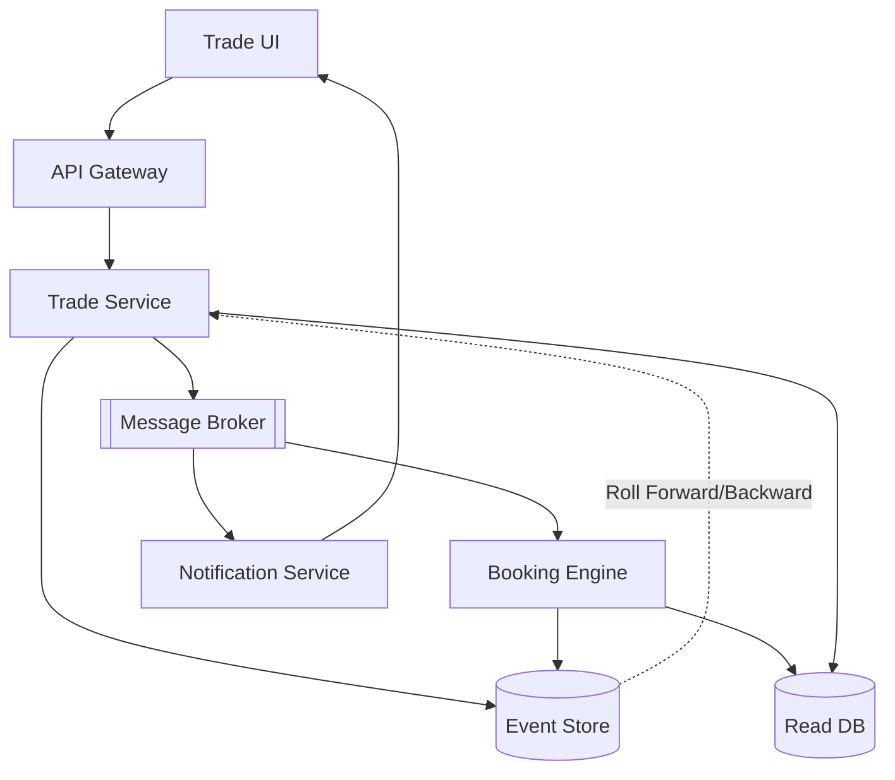

```mermaid
flowchart TD
    UI1[Trade UI]
    APIGW1["API Gateway"]
    TradeSvc1[Trade Service]
    EventStore1[(Event Store)]
    DB1[(Read DB)]
    Broker1[[Message Broker]]
    Booking1[Booking Engine]
    Notify1[Notification Service]

    UI1 --> APIGW1
    APIGW1 --> TradeSvc1
    TradeSvc1 --> EventStore1
    TradeSvc1 --> Broker1
    Broker1 --> Booking1
    Booking1 --> EventStore1
    Booking1 --> DB1
    TradeSvc1 --> DB1
    Broker1 --> Notify1
    Notify1 --> UI1
    EventStore1 -. Roll Forward/Backward .-> TradeSvc1
```