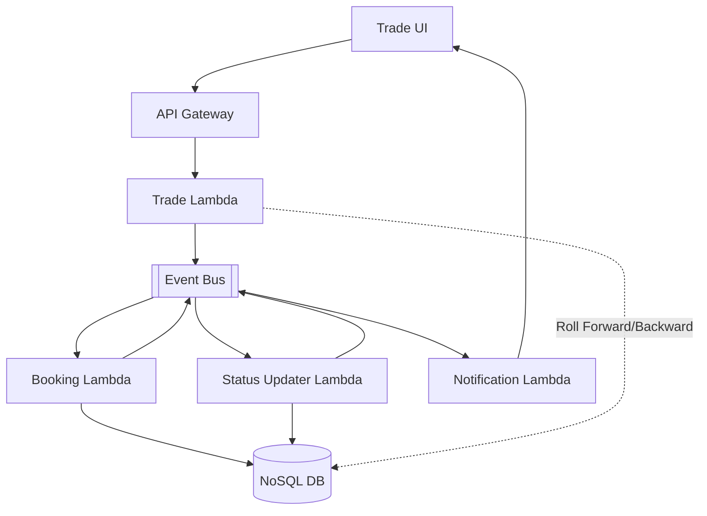

# Trade Processing System Architecture

## Overview of Event-Driven Trade Workflow

The user interacts with the Trade UI, which sends requests to the API Gateway. The gateway forwards these requests to the Trade Lambda function, responsible for handling trade operations. Upon processing, the Trade Lambda publishes events to the Event Bus.

The **Booking Lambda** listens to the Event Bus and processes booking-related events, updating the NoSQL Database with booking information. It also emits further events back to the Event Bus.

The **Status Updater Lambda** subscribes to the Event Bus, updating the trade status in the NoSQL Database and emitting status update events as well.

The **Notification Lambda** consumes events from the Event Bus to send notifications back to the Trade UI, ensuring the user is informed of relevant updates.

The **Trade Lambda** function has a testing capability where it can directly roll forward or backward changes in the NoSQL Database to support testing scenarios.