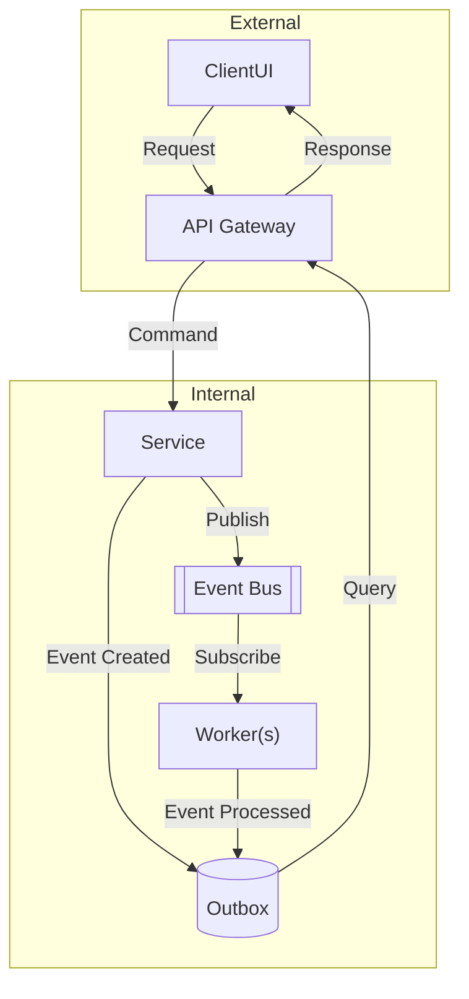

## Transactional Outbox Pattern

> Event-based messaging with Command Query Responsibility Segregation.

### Key Features
 * Trade service writes event to an outbox table within the same transaction as the business entity.
 * Outbox table is polled, and events are published to the broker.
 * Reliable, avoids dual-write issues.
 * Simpler than full event sourcing, but no full event history.

|- Pros -|- Cons -|
| Simpler, transactional integrity, easier to retrofit onto existing systems | No full event sourcing, no event replay, outbox polling adds latency |