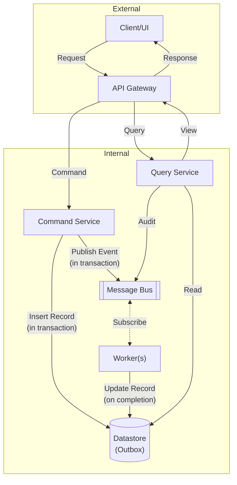

## Transactional Outbox Pattern with Auditable CQRS

> Event-based messaging with Command Query Responsibility Segregation.

```mermaid
flowchart TD
    subgraph External
        ClientUI["Client/UI"]
        APIGW["API Gateway"]
    end

    subgraph Internal
        CmdSvc["Command Service<br>"]
        QrySvc["Query Service"]
        DB[("Datastore<br>(Outbox)")]
        Queue[["Message Bus"]]
        Worker["Worker(s)"]
    end

    ClientUI -- Request --> APIGW
    APIGW -- Command --> CmdSvc
    APIGW -- Query --> QrySvc
    QrySvc -- View --> APIGW

    CmdSvc -- Insert Record<br>(in transaction) --> DB
    CmdSvc -- Publish Event<br>(in transaction) --> Queue
    Worker -- Update Record<br>(on completion) --> DB
    QrySvc -- Read --> DB
    QrySvc -- Audit ---> Queue
    Queue <-. Subscribe .-> Worker
    APIGW -- Response --> ClientUI
```
